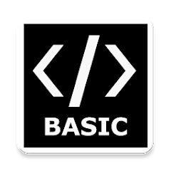

<!-- Begin README -->

    

    
     
    
    
    
     
    

---------------

<h1 align="center">Basic Calculator (BASIC)</h1>

Welcome to the Basic Calculator project implemented in BASIC. This simple calculator program allows users to perform basic arithmetic operations such as addition, subtraction, multiplication, and division.

---------------

## Table of Contents

- [Features](#features)
- [Getting Started](#getting-started)
   - [Installation](#installation)
   - [Usage](#usage)
   - [Notes](#notes)
- [Resources](#resources)
- [License](#license)
- [Credits](#credits)

## Features

The Basic Calculator program offers the following features:

1. **Menu**: The program displays a menu with options for different arithmetic operations and an option to exit.

2. **Arithmetic Operations**: Users can choose from the following arithmetic operations:
   - Addition
   - Subtraction
   - Multiplication
   - Division

3. **Input Validation**: The program handles invalid inputs, such as division by zero or non-numeric inputs, gracefully.

4. **Looping**: Users can perform multiple calculations without exiting the program immediately.

## Getting Started

To use the Basic Calculator program, follow these steps:

### Installation

1. Load the BASIC interpreter on your computer.
2. Copy and paste the provided BASIC code into the interpreter's interface.
3. Run the program to start the Basic Calculator.

### Usage

1. Run the Basic Calculator program in your BASIC interpreter.
2. Choose an operation from the displayed menu by entering the corresponding number.
3. Input the required numbers for the chosen operation.
4. The program will display the result of the calculation or handle errors if necessary.
5. You can perform additional calculations by selecting options from the menu.

### Notes

- This program serves as a simple example of a calculator and may not handle more complex scenarios or operations.
- The specific commands and syntax used in the BASIC code may vary based on the version of BASIC you're using.

## Resources

- [BASIC Programming Language](https://en.wikipedia.org/wiki/BASIC)
- [BASIC Programming Language (Wikibooks)](https://en.wikibooks.org/wiki/BASIC_Programming)

## License

This project is released under the terms of **The Unlicense**, which allows you to use, modify, and distribute the code as you see fit. 
- [The Unlicense](https://choosealicense.com/licenses/unlicense/) removes traditional copyright restrictions, giving you the freedom to use the code in any way you choose.
- For more details, see the [LICENSE](LICENSE) file in this repository.

## Credits

**Author:** [Scott Grivner](https://github.com/scottgriv)  
**Email:** [scott.grivner@gmail.com](mailto:scott.grivner@gmail.com)  
**Website:** [scottgrivner.dev](https://www.scottgrivner.dev)  
**Reference:** [Main Branch](https://github.com/scottgriv/basic-calculator)  

---------------

    

<!-- End README -->